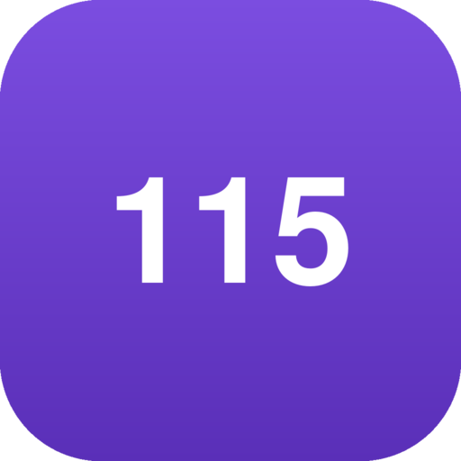

  

<h1 align="center">Project115</h1>

  Offline studiehub voor <strong>ITIL Foundation (Version 5)</strong> en
  <strong>EXIN Information Security Foundation based on ISO/IEC 27001</strong>

  <a href="https://github.com/WimLee115/project115/releases/latest"><strong>Download de nieuwste versie →</strong></a>

---

## Wat het is

Een oefenomgeving die ik heb gebouwd om me voor te bereiden op twee
certificeringsexamens. Geen quiz-app: proefexamens onder dezelfde condities als
de echte afname, met een herhaalschema en een voortgangsoverzicht dat aanwijst
waar je onder de cesuur zit.

- **Proefexamen** — 40 vragen, 60 minuten, cesuur 26, de officiële verdeling
  over de examengebieden, en geen feedback tot je inlevert. ITIL in het Engels
  en ISFS in het Nederlands, net als op je examendag.
- **Oefenen** — directe uitleg per antwoord, inclusief waaróm de andere opties
  fout zijn.
- **Herhalen** — spaced repetition met FSRS: de app plant zelf wat je op het
  punt staat te vergeten.
- **Voortgang** — per leerdoel en examengebied afgezet tegen de cesuur, zodat je
  ziet wát je nog niet weet in plaats van alleen dát je zakt.
- **Begrippen** — tweetalig naast elkaar, 120 termen.

De vragenbank telt **160 zelfgeschreven vragen** die samen elk
assessment-criterium uit beide syllabi afdekken.

## Downloaden

Alles staat onder [Releases](https://github.com/WimLee115/project115/releases/latest).
Kies wat bij je past:

| Bestand | Voor wie |
|---|---|
| `Project115-1.0.0-offline.html` | **Het eenvoudigst.** Eén bestand, dubbelklikken, werkt in elke browser op Windows, macOS, Linux en Chromebook. Geen installatie. |
| `Project115-1.0.0.apk` | Android 7.0 of hoger. Ondertekend; Android vraagt eenmalig om installatie uit deze bron toe te staan. |
| `Project115-1.0.0-web.zip` | Om op een webserver te zetten, bijvoorbeeld voor een groep cursisten. |
| `Project115 - Handleiding.pdf` | Handleiding van elf pagina's. |

Uitgebreidere instructies staan in [INSTALLEREN.md](INSTALLEREN.md).

## Broncode

De volledige broncode staat in deze repository — de webhub, de Android-schil,
de Docker-opzet en de complete vragenbank. Niets is achtergehouden.

Dat is een bewuste keuze. Een app die belooft dat hij niets verstuurt, moet dat
kunnen laten zien. Wil je nagaan of dat klopt: `src/` is de hub, `content/` is
de vragenbank in TypeScript, en `src/lib/crypto.ts` doet de versleuteling.

Zelf draaien, aanpassen of vragen toevoegen: zie
[ONTWIKKELEN.md](ONTWIKKELEN.md). Voor de containeropzet
[DOCKER.md](DOCKER.md), voor de architectuur en de beveiligingsverantwoording
[PLAN.md](PLAN.md).

## Privacy

De app verzamelt niets, verstuurt niets en heeft geen internetverbinding nodig.
Er is geen account en geen server. Je studiegegevens staan op je eigen apparaat
en verlaten het pas wanneer je zelf exporteert. Zie [PRIVACY.md](PRIVACY.md).

Vind je een beveiligingsprobleem? Open een
[security advisory](https://github.com/WimLee115/project115/security/advisories/new),
niet een gewone issue.

## Gebruiksvoorwaarden

Gebruiken en doorgeven mag — aan cursisten, aan collega's, hoe je wilt. Twee
voorwaarden: de vermelding van de maker blijft staan, en de software wordt niet
verkocht. Zie [GEBRUIKSVOORWAARDEN.md](GEBRUIKSVOORWAARDEN.md).

## Over de inhoud

**De vragen zijn origineel.** Alle 160 vragen, hun antwoordopties en de
toelichtingen daarbij zijn zelf geschreven aan de hand van de assessment
criteria uit de openbaar gepubliceerde examenspecificaties. Er is geen enkele
examenvraag overgenomen, niet uit een oefenexamen en niet uit een echt examen.

**De begrippenlijst is dat niet.** Het glossarium geeft de gangbare definities
van de vakterminologie weer, en die formuleringen horen bij het officiële
ITIL-materiaal — het auteursrecht daarop ligt bij PeopleCert. Ze staan erin
omdat het examen precies die formuleringen toetst. Het glossarium is dus een
verwijzing naar het bronmateriaal, geen vervanging ervan; voor deze stof heb je
het officiële cursusmateriaal nodig.

De volledige verantwoording staat in
[GEBRUIKSVOORWAARDEN.md](GEBRUIKSVOORWAARDEN.md).

Slagen voor deze proefexamens is geen garantie dat je voor het echte examen
slaagt.

Kom je een vraag tegen die inhoudelijk niet klopt, of iets dat te dicht bij
beschermd lesmateriaal komt? Open een issue — dan wordt het aangepast of
verwijderd.

## Help mee

Deze app is gemaakt door één persoon die de stof zelf aan het leren was. Dat
betekent dat er fouten in zullen zitten die ik niet zie, en dat er vragen
tussen staan die scherper kunnen.

**Als je de app gebruikt, ben je precies de persoon die dat merkt.** Een docent
die een vraag verkeerd gemarkeerd ziet staan, een cursist die een toelichting
niet snapt omdat hij krom is, iemand die weet dat de syllabus op een punt is
gewijzigd — dat is waardevoller dan wat ik er in mijn eentje aan kan doen.

Wat helpt:

- **Een vraag die niet klopt.** Verkeerd gemarkeerd antwoord, een toelichting
  die de stof verkeerd uitlegt, een begrip dat achterloopt. Dit weegt het
  zwaarst: wie op verkeerde informatie studeert, gaat een examen in dat geld
  kost.
- **Een vraag die beter kan.** Een afleider die te makkelijk weg te strepen is,
  een vraagstelling die twee kanten op te lezen valt.
- **Taal.** De app is tweetalig; kromme zinnen in een van beide talen mogen
  gemeld worden.
- **Nieuwe vragen**, zelf geschreven aan de hand van een assessment-criterium.

Je hoeft geen programmeur te zijn. [Een issue
openen](https://github.com/WimLee115/project115/issues/new/choose) kan met een
GitHub-account en verder niets; er staat een formulier klaar dat je door de
vragen leidt. Wie wél code wil aanraken, vindt in
[CONTRIBUTING.md](CONTRIBUTING.md) hoe het project in elkaar zit.

Wat je meldt wordt aangepast, en je krijgt vermelding bij de wijziging.

## Met dank aan

De ITIL-cursus die aan deze app ten grondslag ligt, volgde ik bij **[IT
Management Group](https://itmg.nl)**. Het idee om de stof in oefenvorm te
gieten komt daarvandaan, en de examensimulatie is gebaseerd op hoe de training
de echte examencondities behandelt.

IT Management Group is niet betrokken bij het maken van deze app en is er niet
verantwoordelijk voor.

## Licentie

Gebruiken, aanpassen en doorgeven mag; de vermelding van de maker blijft staan
en de software wordt niet verkocht. Zie [LICENSE](LICENSE) voor de tekst en
[GEBRUIKSVOORWAARDEN.md](GEBRUIKSVOORWAARDEN.md) voor de uitleg.

Let op: de licentie geldt voor de software en de vragenbank, niet voor de
definities in het ITIL-glossarium — die zijn niet van mij om weg te geven.

## Handelsmerken

ITIL® is een geregistreerd handelsmerk van PeopleCert International Ltd. EXIN®
is een geregistreerd handelsmerk van EXIN Holding B.V. ISO/IEC 27001 is een norm
van ISO en IEC. Project115 is een onafhankelijk oefenhulpmiddel en is niet
gelieerd aan, goedgekeurd door of verbonden met een van deze organisaties, en
evenmin met IT Management Group.

---

Ontwikkeld door **B. van Rooij**
